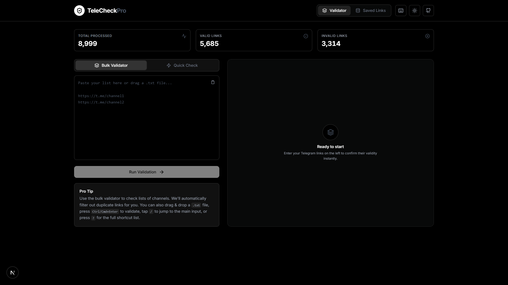

# TeleCheck Pro

TeleCheck Pro is a Next.js 16 app for validating Telegram links in bulk or one at a time. It keeps the existing client-side workflow, talks to the TeleCheck API, and includes dark mode, saved-link browsing, clipboard helpers, and Vercel Analytics.



## Stack

- Next.js 16 App Router
- React 19
- TypeScript
- Tailwind CSS v4
- Lucide React
- Sonner
- Vercel Analytics

## Getting Started

Prerequisites:

- Node.js 20.9 or newer
- npm

Install dependencies and start the dev server:

```bash
npm install
npm run dev
```

The app will be available at `http://localhost:3000`.

## Environment Variables

Copy `.env.example` to `.env.local` if you want to override the default API origin.

```bash
NEXT_PUBLIC_TELECHECK_API_URL=https://telecheck.vercel.app
```

## Project Structure

```text
app/             Next.js App Router files
components/      Reusable UI components
services/        API service helpers
utils/           Utility functions
public/          Static assets
App.tsx          Client-side application shell
types.ts         Shared TypeScript types
```
## Features

- **Bulk & Single Link Validation** — Check one or thousands of Telegram links at once.
- **Saved Links Dashboard** — Browse, search, and paginate all stored links from the database.
- **Global Link Tagging** — Categorize links with predefined tags (Crypto, News, Entertainment, Finance, Gaming, Tech, Education, Music, Sports, Other). Tags are stored globally in PostgreSQL and shared across all users.
- **Tag Filtering** — Filter saved links by tag using the chip row on the dashboard.
- **Dark Mode** — System-aware light/dark theme toggle.
- **Clipboard Helpers** — Copy single or bulk links with one click.
- **Contributors Leaderboard** — Track who added the most links.
- **Vercel Analytics** — Built-in analytics integration.

## API Integration

The frontend calls the TeleCheck API for:

- `GET /stats` — Fetch global statistics
- `GET /?link=...` — Check a single link
- `POST /` — Batch check multiple links
- `GET /links?platform=telegram&limit=...&offset=...&search=...&tag=...` — Fetch saved links with optional tag filter
- `GET /tags` — Fetch all unique tags used across links
- `POST /links/tags` — Assign tags to a link (`{ url, tags }`)
- `GET /contributors` — Leaderboard
- `GET /contributors/me` — Current user profile

## License

This project is licensed under the MIT License. See [LICENSE](LICENSE) for details.
